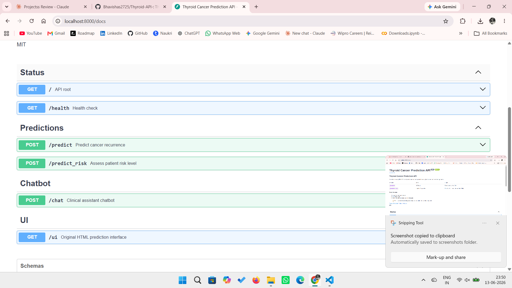
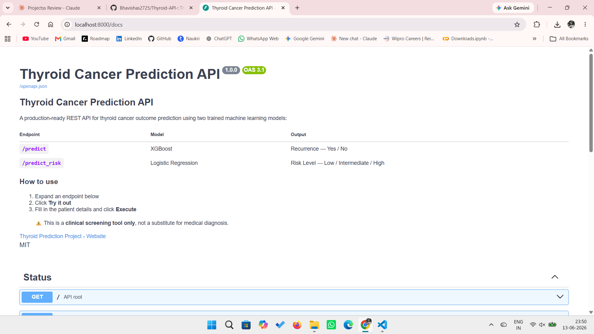
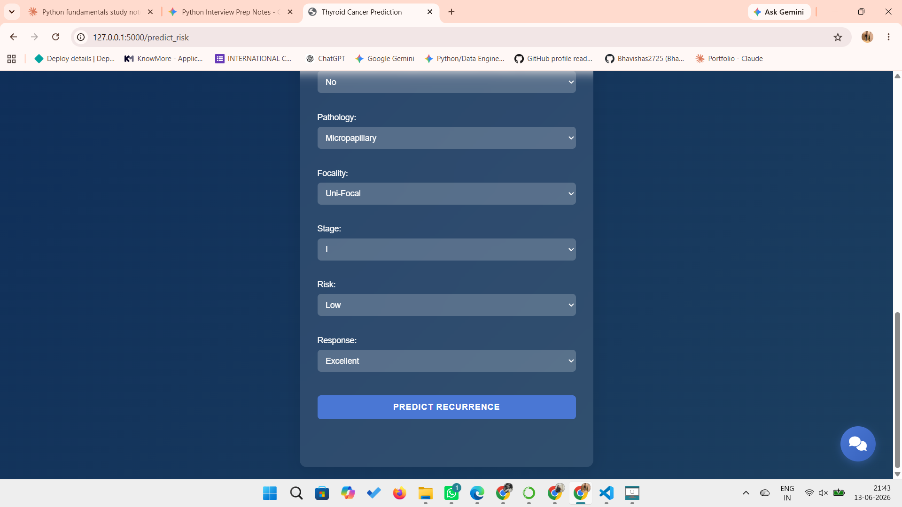
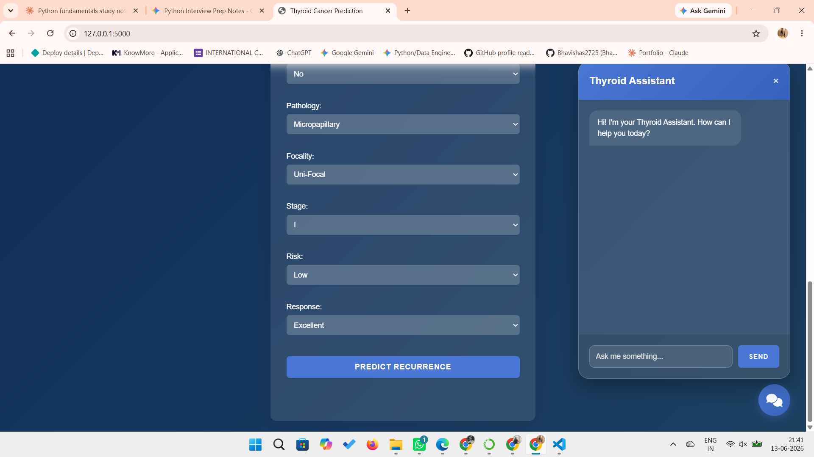

# Thyroid Cancer Prediction API

> A production-ready **FastAPI** REST API wrapping two trained machine learning models for thyroid cancer outcome prediction — **Recurrence Prediction** (XGBoost) and **Risk Assessment** (Logistic Regression) — with full **OpenAPI 3.0 / Swagger UI** documentation, a clinical chatbot endpoint, and the original HTML interface still served at `/ui`.


---

## Demo




## WebApp




---

## Overview

This project upgrades the original Flask-based Thyroid Classification System into a **fully documented REST API** using FastAPI. It exposes two trained ML models — an **XGBoost classifier** for recurrence prediction and a **Logistic Regression model** for patient risk stratification — through clean, validated JSON endpoints with interactive Swagger documentation.

The original HTML form-based interface is preserved and served at `/ui`, while a built-in clinical chatbot is available via `/chat`.

---

## Features

- **Two prediction endpoints** — `/predict` (recurrence) and `/predict_risk` (risk level), both returning a label + confidence score
- **Interactive Swagger UI** — full OpenAPI 3.0 docs at `/docs` with "Try it out" support for every endpoint
- **Pydantic v2 validation** — every input field is type-checked and constrained (e.g. `age` between 1–120, enums for categorical fields)
- **Health check endpoint** — `/health` confirms both models loaded successfully at startup
- **Lifespan model loading** — models load once at startup (not per-request) for fast inference
- **Built-in clinical chatbot** — `/chat` answers questions about recurrence, risk levels, and API usage
- **CORS enabled** — ready to be called from any frontend
- **Legacy HTML UI preserved** — original glassmorphism-styled form still served at `/ui`

---

## Results

| Model | Task | Accuracy |
|-------|------|----------|
| **XGBoost Classifier** | Recurrence Prediction | **93.15%** |
| **Logistic Regression** | Risk Assessment | **82.19%** |

### Recurrence Prediction — Classification Report (Test Set, 80/20 Split)

| Class | Precision | Recall | F1-Score | Support |
|---|---|---|---|---|
| No Recurrence (0) | 0.98 | 0.92 | **0.95** | 51 |
| Recurrence (1) | 0.84 | 0.95 | **0.89** | 22 |
| **Macro Avg** | 0.91 | 0.94 | **0.92** | 73 |
| **Weighted Avg** | 0.94 | 0.93 | **0.93** | 73 |

Both models were selected via **PyCaret AutoML benchmarking** with 5-fold cross-validation and hyperparameter tuning. Full training pipeline is documented in the accompanying notebook.

---

## Project Structure

```
thyroid-prediction-api/
│
├── main.py                         # FastAPI app — routes, schemas, chatbot, lifespan
├── model_utils.py                  # Model loading + preprocessing logic
├── requirements.txt                # Python dependencies
├── README.md
├── .gitignore
│
├── model/                           # Pre-trained model artefacts
│   ├── thyroid_xgb_recur.pkl        # XGBoost recurrence model
│   ├── logistic_risk_model.pkl      # Logistic Regression risk model
│   ├── label_encoders_recur.pkl     # Label encoders (recurrence)
│   ├── label_encoders_risk.pkl      # Label encoders (risk)
│   ├── feature_order_recur.pkl      # Feature order (recurrence)
│   ├── feature_order_risk.pkl       # Feature order (risk)
│   └── age_scaler_risk.pkl          # StandardScaler for age
│
├── templates/
│   └── index.html                   # Legacy HTML UI (served at /ui)
│
├── static/
│   └── css/
│       └── style.css                # Glassmorphism styling
│
└── results/
    ├── swagger_ui.png
    ├── webapp1.png
    ├── webapp2.png
    └── chatbot.png
```

---

## Installation & Setup

### Prerequisites

- Python 3.7 or higher
- pip

### Steps

```bash
# 1. Clone the repository
git clone https://github.com/Bhavishas2725/THYROID-PREDICTION-API.git
cd THYROID-PREDICTION-API

# 2. (Optional) Create a virtual environment
python -m venv venv
source venv/bin/activate        # On Windows: venv\Scripts\activate

# 3. Install dependencies
pip install -r requirements.txt

# 4. Ensure all .pkl files are inside the model/ directory
```

---

## Usage

```bash
python main.py
```

The API will start on `http://0.0.0.0:8000` with hot-reload enabled.

| URL | Description |
|---|---|
| `http://localhost:8000/docs` | **Swagger UI** — interactive API documentation |
| `http://localhost:8000/redoc` | ReDoc — alternative API documentation |
| `http://localhost:8000/ui` | Legacy HTML form interface |
| `http://localhost:8000/health` | Health check |

---

## Tech Stack

| Layer | Technology |
|---|---|
| **API Framework** | FastAPI, Uvicorn |
| **Validation** | Pydantic v2 |
| **ML Models** | XGBoost, Logistic Regression, Scikit-learn |
| **AutoML** | PyCaret 3.3.2 |
| **Preprocessing** | Pandas, NumPy, StandardScaler, LabelEncoder |
| **Model Persistence** | Joblib |
| **Legacy Frontend** | HTML5, CSS3 (Glassmorphism), Jinja2 |
| **Docs** | OpenAPI 3.0 (Swagger UI + ReDoc) |

---

## API Endpoints

| Method | Endpoint | Description |
|---|---|---|
| `GET` | `/` | API status + links to docs |
| `GET` | `/health` | Health check — confirms both models loaded |
| `POST` | `/predict` | Recurrence prediction (XGBoost) — returns Yes/No + confidence |
| `POST` | `/predict_risk` | Risk assessment (Logistic Regression) — returns Low/Intermediate/High + confidence |
| `POST` | `/chat` | Clinical assistant chatbot |
| `GET` | `/ui` | Legacy HTML form interface |
| `GET` | `/docs` | Swagger UI |
| `GET` | `/redoc` | ReDoc documentation |

---

## Example: Recurrence Prediction

```bash
curl -X POST "http://localhost:8000/predict" \
  -H "Content-Type: application/json" \
  -d '{
    "age": 45,
    "gender": "F",
    "smoking": "No",
    "hx_smoking": "No",
    "hx_radiotherapy": "No",
    "thyroid_function": "Euthyroid",
    "physical_examination": "Single nodular goiter-left",
    "adenopathy": "No",
    "pathology": "Papillary",
    "focality": "Uni-Focal",
    "stage": "I",
    "risk": "Low",
    "response": "Excellent"
  }'
```

**Response:**
```json
{
  "recurrence": "No",
  "confidence_pct": 91.24,
  "message": "Recurrence Prediction: No (91.24% confidence)"
}
```

---

## Example: Risk Assessment

```bash
curl -X POST "http://localhost:8000/predict_risk" \
  -H "Content-Type: application/json" \
  -d '{
    "age": 52,
    "gender": "M",
    "smoking": "Yes",
    "hx_smoking": "Yes",
    "hx_radiotherapy": "No",
    "thyroid_function": "Euthyroid",
    "physical_examination": "Multinodular goiter",
    "adenopathy": "Right",
    "pathology": "Follicular",
    "focality": "Multi-Focal",
    "stage": "III"
  }'
```

**Response:**
```json
{
  "risk_level": "High",
  "confidence_pct": 88.5,
  "message": "Risk Level: High (88.5% confidence)"
}
```

---

## Example: Chatbot

```bash
curl -X POST "http://localhost:8000/chat" \
  -H "Content-Type: application/json" \
  -d '{"message": "What is recurrence prediction?"}'
```

**Response:**
```json
{
  "response": "Recurrence prediction uses XGBoost to determine if thyroid cancer is likely to return (Yes/No) after treatment."
}
```

---

## Input Fields Reference

| Field | Type | Allowed Values |
|---|---|---|
| `age` | int | 1–120 |
| `gender` | enum | `F`, `M` |
| `smoking` | enum | `Yes`, `No` |
| `hx_smoking` | enum | `Yes`, `No` |
| `hx_radiotherapy` | enum | `Yes`, `No` |
| `thyroid_function` | enum | `Euthyroid`, `Clinical Hyperthyroidism`, `Clinical Hypothyroidism`, `Subclinical Hyperthyroidism`, `Subclinical Hypothyroidism` |
| `physical_examination` | enum | `Diffuse goiter`, `Multinodular goiter`, `Normal`, `Single nodular goiter-left`, `Single nodular goiter-right` |
| `adenopathy` | enum | `No`, `Right`, `Left`, `Bilateral`, `Extensive`, `Posterior` |
| `pathology` | enum | `Papillary`, `Micropapillary`, `Follicular`, `Hurthel cell` |
| `focality` | enum | `Uni-Focal`, `Multi-Focal` |
| `stage` | enum | `I`, `II`, `III`, `IVA`, `IVB` |
| `risk` *(recurrence only)* | enum | `Low`, `High` |
| `response` *(recurrence only)* | enum | `Excellent`, `Biochemical Incomplete`, `Indeterminate`, `Structural Incomplete` |

---

## Notebook

The full model development pipeline is documented in:

```
Thyroid Classification System Review - Final.ipynb
```

This notebook covers:
- Exploratory Data Analysis (EDA)
- Data preprocessing & encoding
- PyCaret AutoML model benchmarking
- XGBoost hyperparameter tuning for recurrence prediction
- Logistic Regression training for risk classification
- Model evaluation (accuracy, classification report, confusion matrix)
- Model serialization with Joblib

---

## Author

**Bhavisha S**  
B.E. Computer Science (AI & ML) — AMET University, Chennai  
📧 bhavishasiva272@gmail.com  
🔗 [LinkedIn](https://linkedin.com/in/bhavishasiva-) | [GitHub](https://github.com/Bhavishas2725) | [Portfolio](https://bhavishas.netlify.app/)

---

## License

This project is licensed under the [MIT License](LICENSE).

---

## Acknowledgements

- Dataset sourced from clinical thyroid cancer records
- [PyCaret](https://pycaret.org/) for automated model benchmarking
- [XGBoost](https://xgboost.readthedocs.io/) for the recurrence classification model
- [FastAPI](https://fastapi.tiangolo.com/) for the API framework

---

> **Disclaimer:** This API is a **clinical screening tool only** and is not intended for clinical diagnosis. Always consult a qualified medical professional.
